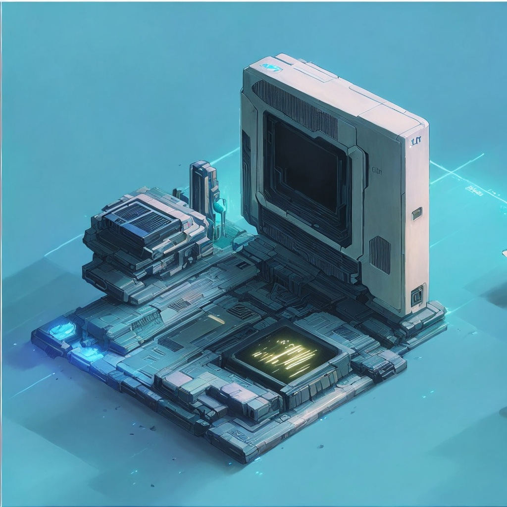
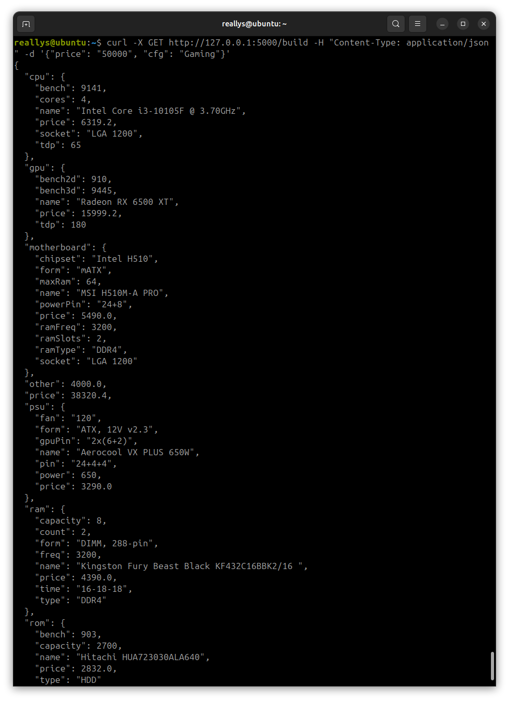
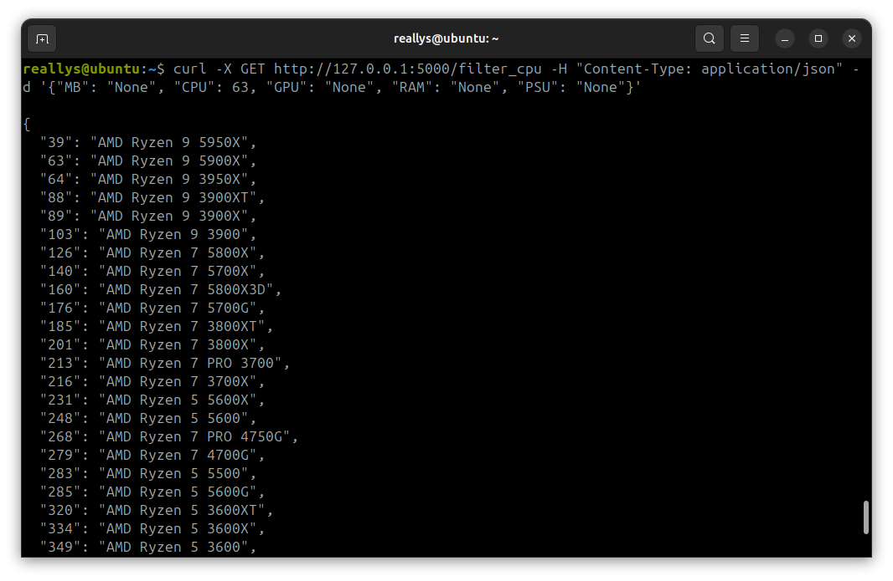

# PC Builder API

## Пример использования автосборщика
curl -X GET http://127.0.0.1:5000/build -H "Content-Type: application/json" -d '{"price": "50000", "cfg": "Gaming"}'

### Вывод

## Отдельная часть в зависимости от уже установленных
### Запросы (GET)
- filter_mb
- filter_cpu
- filter_gpu
- filter_ram
- filter_psu
### Примеры
- curl -X GET http://127.0.0.1:5000/filter_mb -H "Content-Type: application/json" -d '{"MB": "None", "CPU": 63, "GPU": 7, "RAM": 3, "PSU": "None"}'
- curl -X GET http://127.0.0.1:5000/filter_cpu -H "Content-Type: application/json" -d '{"MB": "None", "CPU": "None", "GPU": "None", "RAM": "None", "PSU": "None"}'
### Вывод
